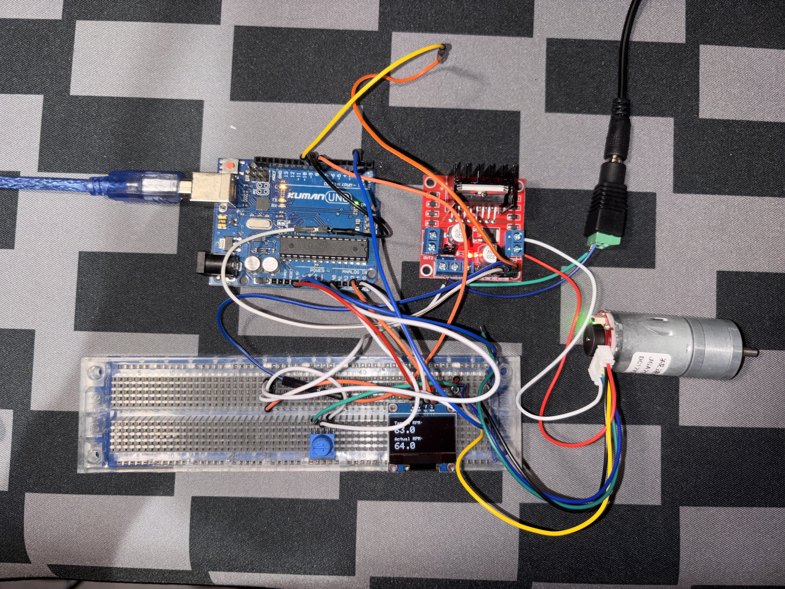
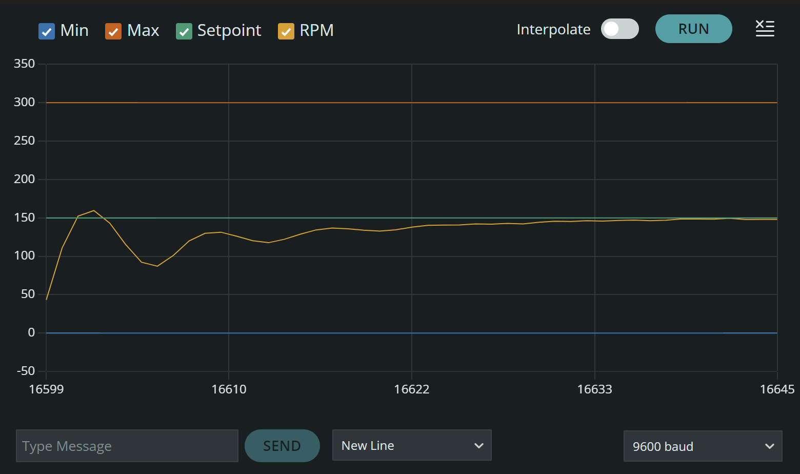
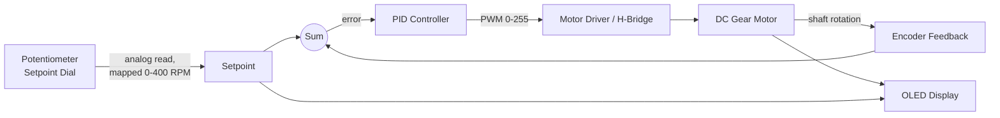
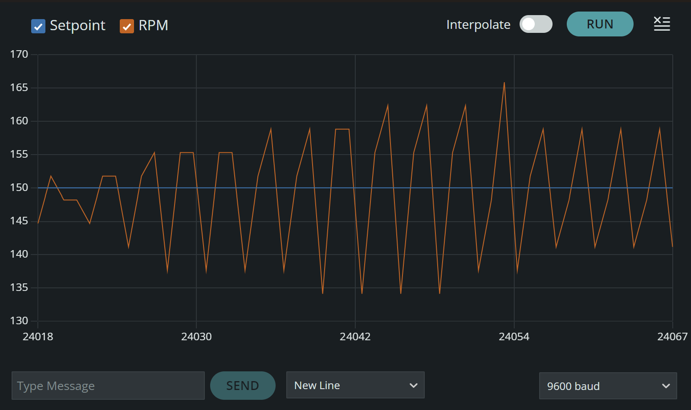
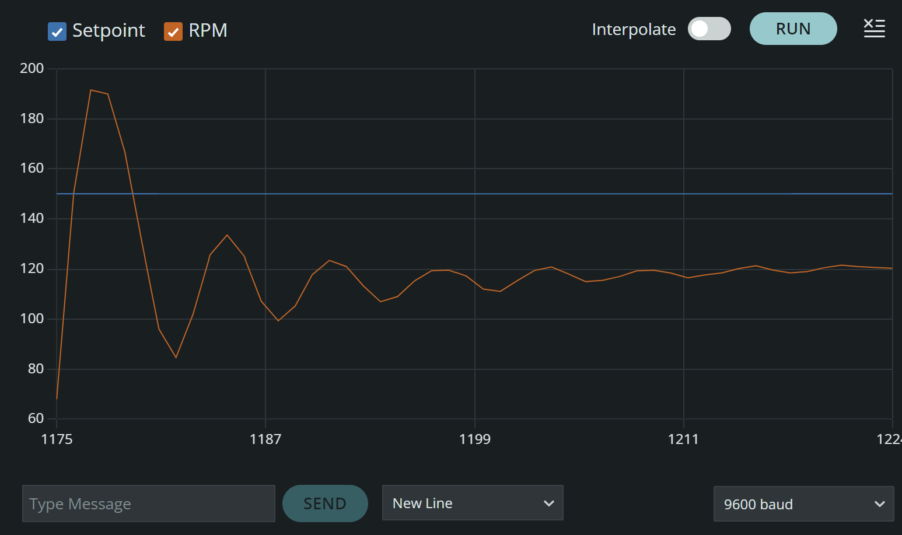
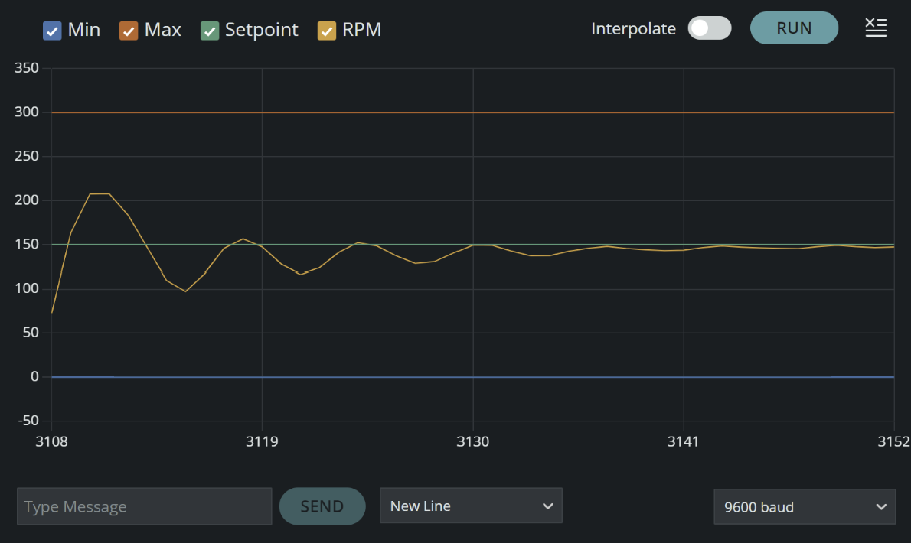

# PID Motor Speed Controller

Closed-loop DC motor speed control using a quadrature encoder for feedback and a PID
algorithm to hold a target RPM, running on an Arduino Uno. Includes real-time serial
plotting and an OLED status display.

*Arduino Uno, L298N motor driver, GA25-370 encoder motor, potentiometer, and OLED display with a live RPM readout shown on screen.*

*Kp=0.5, Ki=0.5, Kd=0.08 — settles within one overshoot/undershoot cycle (~157 RPM
peak, ~90 RPM trough) and holds steady at setpoint.*

## Results

With a live, continuously-varying setpoint (driven by a potentiometer rather than a
fixed step), the controller tracks a ramping target with **one damped
overshoot/undershoot cycle** before settling, and holds within roughly **±2 RPM of
setpoint at steady state**.

## Hardware

| Component | Details |
|---|---|
| Arduino Uno | Microcontroller |
| L298N H-Bridge | Motor driver |
| DC motor with rotary encoder | GA25-370, 12V, 500 RPM nominal |
| 0.96" OLED display (SSD1306) | I2C status display |
| 10K potentiometer | Setpoint dial |
| 12V power supply or battery pack | Motor power |
| Breadboard + jumper wires | — |

## System Block Diagram

## How It Works

1. **Speed measurement:** A hardware interrupt counts encoder pulses on every rising
   edge. Every 100 ms, the tick count is converted to RPM:
   `RPM = (ticks / PPR) * (60000 / interval_ms)`
2. **Noise filtering:** Raw RPM is smoothed with an exponential moving average (EMA)
   before being used anywhere else in the loop, since tick-count-based measurement
   over a short window is inherently noisy.
3. **PID calculation:** Standard proportional + integral + derivative sum, with:
   - A second EMA filter applied specifically to the derivative term (derivative
     amplifies noise more than any other term).
   - Conditional-integration anti-windup — the integral only accumulates when doing
     so wouldn't push the output past the PWM actuator limits (0–255).
4. **Actuation:** Final PID output is clamped to 0–255 (the PID math itself has no
   upper or lower bound, but `analogWrite` only accepts an 8-bit PWM duty cycle, so
   the raw sum has to be forced into the range the hardware can actually accept) and
   written via `analogWrite` to the motor driver's PWM input.

## Encoder Calibration

Rather than trust the nominal spec (11 pulses/rev × assumed 20:1 gear ratio = 220
PPR), I calibrated empirically: rotated the output shaft a measured number of full
turns by hand and counted ticks directly.

- Measured: **170 PPR** (averaged over 5 trials)
- Implied gear ratio: ~15.5:1, not the assumed 20:1

## Tuning Process

**Initial attempt** — naive PID with unfiltered RPM feedback:

*Kp=0.6, Ki=0.1, Kd=0.05 — oscillation amplitude grows over time rather than settling*

Diagnosis: the derivative term was amplifying tick-count measurement noise (division
by a small `dt` multiplies noise), and the integral anti-windup only clamped the
final value rather than preventing over-accumulation during saturation, both
contributing to a sustained/growing limit cycle.

**Fix:** added EMA filtering on the RPM measurement and on the derivative term, and
switched to conditional-integration anti-windup.

*Kp=1.0, Ki=0.08, Kd=0.02 — clean damped response, but settles ~30 RPM below setpoint*

Diagnosis: proportional control alone cannot fully close steady-state error against
real motor friction/load, that gap can only be closed by the integral term, and Ki
was too small to close it in a reasonable time.

**Increased Ki to close the steady-state gap:**

*Kp=1.0, Ki=0.75, Kd=0.02 — closes the steady-state gap, but rings through roughly two
decaying overshoot/undershoot cycles before settling*

**Isolating the double-oscillation:** to find the cause, Kp was held fixed at 1.0
while Ki and Kd were varied independently across several tests (Ki: 0.75 → 0.35 → 0.5;
Kd: 0.02 → 0.2 → 0.08). The first overshoot peak stayed essentially unchanged
(~205–233 RPM) across every one of these combinations — strong evidence that Kp, not
Ki or Kd, was driving the size of that first overshoot, since neither term had moved
it despite multiple independent tests.

**Final tune:** lowered Kp itself (1.0 → 0.6 → 0.5), keeping Ki=0.5 and Kd=0.08 fixed.
The first overshoot dropped sharply with each reduction (≈205 → 170 → 157 RPM), while
the undershoot depth stayed roughly constant (~90–100 RPM) regardless of Kp.

*Kp=0.5, Ki=0.5, Kd=0.08 — settles after one overshoot/undershoot cycle (~157 RPM peak,
~90 RPM trough), then a smooth, non-oscillatory approach to setpoint*

## Live Setpoint via Potentiometer

The initial tuning above used a fixed, hardcoded setpoint (150 RPM) for a clean,
repeatable step-response test. Once the gains were validated, the setpoint was
switched to a potentiometer read on an analog pin, mapped to a 0–400 RPM range, so
the target speed can be changed live by turning a knob.

A moving setpoint introduces failure modes a fixed step test doesn't expose:

- **Small electrical noise on the analog reading** could cause the setpoint to
  flicker by a couple RPM every loop, which would look like a disturbance to the
  derivative term. Fixed with a simple deadband: the setpoint only updates if the
  new reading differs from the current one by more than 3 RPM.
- **A fast knob turn** creates a rapid setpoint change, which risks a derivative
  kick if the derivative is computed on error rather than on the measurement itself
  (derivative-on-error reacts to setpoint changes; derivative-on-measurement does
  not, since it only differentiates the physical RPM signal).

*Kp=0.5, Ki=0.5, Kd=0.08 — RPM (orange) tracks a setpoint (green) jump, with one overshoot to one undershoot before settling and
holding steady-state tracking at the new target*

## Final PID Gains

| Gain | Value | Purpose |
|---|---|---|
| Kp | 0.5 | Primary response to instantaneous error; lowered from an initial 1.0 after isolating it as the driver of first-overshoot magnitude |
| Ki | 0.5 | Eliminates steady-state error from motor friction/load |
| Kd | 0.08 | Damps overshoot; raised from an initial 0.02 now that the derivative acts on a filtered signal |

## Lessons Learned

- Sensor noise, not just gain values, can be the root cause of oscillation.
  Filtering the measurement is important in the tuning process.
- Anti-windup implementation matters: clamping the integral's final value is not the
  same as preventing it from over-accumulating in the first place.
- Empirical calibration (measuring encoder PPR directly) caught an incorrect
  assumption that a spec-sheet/datasheet number would have missed.
- Isolating one gain at a time was
  what actually revealed which gain caused which symptom. Multiple tests where Ki
  and Kd changed with no effect on the first overshoot were what pointed to Kp as
  the real cause, rather than guessing.

## Future Improvements

- Reset the integral term on large setpoint jumps, so accumulated history from the
  old target doesn't bleed into the transient response at a new one
- Quadrature (2-channel) decoding for direction sensing and 4x resolution
- Auto-tuning via relay/Ziegler-Nichols method triggered by a button press
- Using more precise motors and potentiometers to reduce error.
